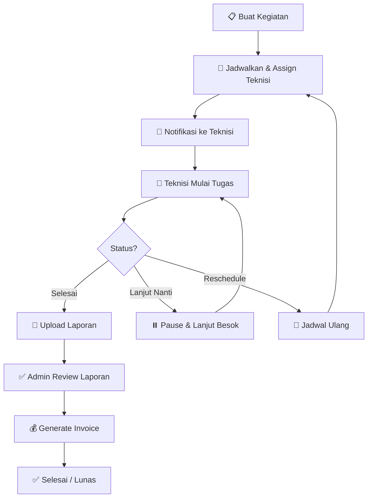

<p align="center">
  
</p>

<h1 align="center">Loewix — Sistem Manajemen Teknisi</h1>

<p align="center">
  <strong>Platform penjadwalan, pelacakan, dan pelaporan kegiatan teknisi secara real-time.</strong>
</p>

<p align="center">
  
  
  
  
  
</p>

---

## 📖 Deskripsi

**Loewix** adalah sistem manajemen operasional teknisi yang mencakup **web admin panel** dan **aplikasi mobile Android**. Dibangun untuk mengelola seluruh siklus kegiatan teknisi — mulai dari penjadwalan, pelaksanaan di lapangan, pelaporan, hingga penagihan invoice.

### Highlights
- 📅 **Penjadwalan Cerdas** — Auto-generate kode kegiatan berdasarkan riwayat customer
- 📍 **Real-time Tracking** — Pelacakan lokasi teknisi via GPS (Mapbox)
- 📸 **Dokumentasi Lapangan** — Foto sebelum/sesudah, voice recording, catatan
- 📊 **Dashboard Analytics** — Statistik performa teknisi, progres kegiatan, chart
- 🔔 **Notifikasi Push** — Tugas aktif & laporan belum diupload (dual-channel)
- 📱 **Auto-Update** — Sistem update APK otomatis dari server

---

## 🏗️ Arsitektur

```
┌─────────────────────────────────────────────────────────┐
│                      PRODUCTION                         │
├──────────────────┬──────────────────────────────────────┤
│                  │                                      │
│  📱 Mobile App   │  🌐 Web Admin Panel                  │
│  (Flutter/Dart)  │  (PHP + MySQL)                       │
│                  │                                      │
│  ┌────────────┐  │  ┌──────────────┐ ┌───────────────┐  │
│  │ Teknisi App│  │  │ Staff Panel  │ │ Teknisi Web   │  │
│  │ Android    │  │  │ /staff/      │ │ /staff/teknisi│  │
│  └─────┬──────┘  │  └──────┬───────┘ └───────┬───────┘  │
│        │         │         │                 │          │
│        ▼         │         ▼                 ▼          │
│  ┌────────────────────────────────────────────────────┐ │
│  │            REST API (Laravel/PHP)                  │ │
│  │         api-teknisi.id-giti.com/api/v4             │ │
│  └────────────────────┬───────────────────────────────┘ │
│                       │                                 │
│                       ▼                                 │
│              ┌─────────────────┐                        │
│              │  MySQL Database │                        │
│              │  teknisi_api_root│                       │
│              └─────────────────┘                        │
└─────────────────────────────────────────────────────────┘
```

---

## 📂 Struktur Folder

```
jadwal.id-giti.com/
├── staff/                          # 🌐 Web Admin Panel (Super Admin)
│   ├── index.php                   #    Dashboard utama
│   ├── kegiatan-baru.php           #    Tambah kegiatan baru
│   ├── kegiatan-db.php             #    Database kegiatan (CRUD)
│   ├── waiting-list.php            #    Antrian kegiatan
│   ├── lap-kegiatan.php            #    Laporan kegiatan
│   ├── lap-progress.php            #    Progres kegiatan
│   ├── customer-detail.php         #    Riwayat customer
│   ├── data-teknisi.php            #    Manajemen data teknisi
│   ├── inventory.php               #    Stok barang & peminjaman
│   ├── tutorial.php                #    Modul tutorial teknisi
│   ├── mobile/                     #    Versi mobile-responsive
│   ├── sales/                      #    Modul sales
│   ├── teknisi/                    #    Panel web untuk teknisi
│   ├── api_app_version.php         #    API cek versi APK
│   ├── apk/                        #    Storage APK untuk auto-update
│   └── assets/                     #    CSS, JS, Images
│
├── loewix-teknisi-mobile-main/     # 📱 Aplikasi Mobile (Flutter)
│   ├── lib/
│   │   ├── main.dart               #    Entry point aplikasi
│   │   ├── constants/              #    Konfigurasi (API URL, Mapbox, dll)
│   │   ├── page/                   #    Halaman-halaman UI
│   │   │   ├── Auth/               #      Login, Register
│   │   │   ├── Dashboard/          #      Dashboard teknisi
│   │   │   ├── Task/               #      Detail tugas, laporan
│   │   │   ├── Maps/               #      Peta lokasi customer
│   │   │   ├── History/            #      Riwayat kegiatan
│   │   │   ├── Invoice/            #      Invoice / payment
│   │   │   ├── Statistik/          #      Chart performa
│   │   │   ├── Pinjam_Barang/      #      Peminjaman barang
│   │   │   ├── reimburse/          #      Claim reimbursement
│   │   │   └── tutor/              #      Tutorial & panduan
│   │   ├── service/
│   │   │   ├── api/                #      API service classes
│   │   │   ├── model/              #      Data models
│   │   │   ├── provider/           #      State management (Provider)
│   │   │   ├── notification/       #      Push notification (WorkManager)
│   │   │   └── update/             #      Auto-update APK
│   │   ├── widget/                 #    Reusable widgets
│   │   └── utils/                  #    Helper utilities
│   ├── android/                    #    Android native config
│   ├── assets/                     #    Icons, images
│   └── pubspec.yaml                #    Dependencies
│
├── uploads/                        # 📁 Upload storage (foto, dokumen)
├── img/                            # 🖼️ Static images
├── css/                            # 🎨 Stylesheets
├── js/                             # ⚡ JavaScript files
└── .htaccess                       # 🔒 Security configuration
```

---

## 📱 Aplikasi Mobile — Fitur

| Fitur | Deskripsi |
|-------|-----------|
| **Dashboard** | Ringkasan tugas hari ini, statistik performa, chart |
| **Daftar Tugas** | Lihat tugas dijadwalkan, sedang berjalan, selesai |
| **Mulai Tugas** | Slide-to-start dengan validasi lokasi GPS |
| **Laporan** | Upload foto (5 slot), catatan, permasalahan & solusi |
| **Lanjut Nanti** | Pause tugas, lanjutkan di hari berikutnya |
| **Reschedule** | Jadwalkan ulang tugas ke tanggal lain |
| **Peta** | Navigasi ke lokasi customer (Mapbox / OpenStreetMap) |
| **Peminjaman Barang** | Request & kembalikan alat/barang dari gudang |
| **Reimbursement** | Claim biaya operasional dengan bukti foto |
| **Invoice** | Lihat status invoice & payment |
| **Statistik** | Chart performa bulanan, pencapaian target |
| **Tutorial** | Panduan kerja, SOP, video tutorial |
| **Notifikasi** | Push notification tugas aktif & laporan pending |
| **Auto-Update** | Download APK terbaru dari server otomatis |

---

## 🌐 Web Admin — Fitur

| Modul | Deskripsi |
|-------|-----------|
| **Dashboard** | Overview kegiatan harian + chart |
| **Kegiatan** | CRUD kegiatan, assign teknisi, jadwalkan |
| **Waiting List** | Antrian kegiatan belum dijadwalkan |
| **Laporan** | Laporan kegiatan, progres, No Payment tracking |
| **Customer** | Database customer + riwayat kegiatan lengkap |
| **Teknisi** | Manajemen teknisi, detail performa, soft-delete |
| **Stok Barang** | Inventaris alat + tracking peminjaman |
| **Tutorial** | Upload materi training untuk teknisi |
| **Pendapatan** | Invoice, tracking pembayaran, laporan keuangan |
| **Export** | Export laporan ke Excel/PDF |

---

## 🛠️ Tech Stack

### Mobile App
| Teknologi | Versi | Kegunaan |
|-----------|-------|----------|
| Flutter | 3.6+ | UI Framework |
| Dart | ^3.6.0 | Programming Language |
| Provider | 6.1.2 | State Management |
| Mapbox | - | Maps & Navigation |
| WorkManager | 0.5.2 | Background Notifications |
| flutter_local_notifications | 18.0.1 | Push Notifications |
| fl_chart | 0.64.0 | Charts & Graphs |
| Geolocator | 10.0.1 | GPS Location |
| image_picker | 1.0.7 | Camera & Gallery |
| shared_preferences | 2.2.3 | Local Storage |

### Web Admin
| Teknologi | Kegunaan |
|-----------|----------|
| PHP 8.x | Backend & Server-side rendering |
| MySQL | Relational Database |
| Bootstrap + Soft UI | Admin Panel UI Framework |
| jQuery | DOM Manipulation |
| Chart.js | Dashboard Charts |
| Leaflet / Mapbox GL | Maps Integration |
| PhpSpreadsheet | Excel Export |

### Infrastructure
| Layanan | Kegunaan |
|---------|----------|
| aaPanel | Server Management |
| Ubuntu 24.04 LTS | Production OS |
| Apache/Nginx | Web Server |
| Let's Encrypt | SSL Certificate |
| GitHub | Version Control |

---

## ⚙️ Setup & Installation

### Prerequisites
- **Flutter SDK** ≥ 3.6.0
- **PHP** ≥ 8.0
- **MySQL** ≥ 5.7
- **Composer** (PHP dependency manager)
- **Android Studio** / VS Code

### Mobile App Setup

```bash
# Clone repository
git clone https://github.com/WagYu31/Repo-WEB-MOBILE-TEKNISI.git
cd Repo-WEB-MOBILE-TEKNISI/loewix-teknisi-mobile-main

# Install dependencies
flutter pub get

# Konfigurasi API URL
# Edit lib/constants/app_constants.dart
# Ubah apiBaseUrl sesuai environment

# Run di development
flutter run

# Build APK Release
flutter build apk --release
```

### Web Admin Setup

```bash
# Setup di web server (Apache/Nginx)
# 1. Point domain ke folder /staff/
# 2. Import database schema
# 3. Konfigurasi conn.php dengan credentials database
# 4. Set permissions: chmod 755 uploads/
```

---

## 🔐 Security

- ✅ `.htaccess` protection — blokir akses file sensitif (`.sql`, `.env`, `.log`)
- ✅ Security Headers — `X-Frame-Options`, `X-XSS-Protection`, `CSP`
- ✅ PHP execution blocked di `/uploads/`
- ✅ Session-based authentication
- ✅ Prepared statements (SQL injection prevention)
- ✅ Input sanitization (`htmlspecialchars`)
- ✅ Backup file access blocked

---

## 📦 Deployment

### Build APK
```bash
cd loewix-teknisi-mobile-main
flutter build apk --release
# Output: build/app/outputs/flutter-apk/app-release.apk
```

### Auto-Update Server
APK di-upload ke `/staff/apk/` dan versi diatur di `api_app_version.php`:
```php
"version" => "4.0.17",
"url" => "https://jadwal.id-giti.com/staff/apk/teknisi-v4.0.17.apk"
```

Aplikasi mobile otomatis cek versi dan prompt download jika ada update.

---

## 📋 Database Schema (Key Tables)

| Tabel | Deskripsi |
|-------|-----------|
| `kegiatan` | Master data kegiatan/tugas |
| `pelaksanaan_kegiatan` | Record pelaksanaan (absensi, status, foto) |
| `customer` | Data pelanggan |
| `teknisi` | Data teknisi |
| `pendapatan_kegiatan` | Invoice & pembayaran |
| `barang` | Inventaris stok barang |
| `peminjaman_barang` | Tracking peminjaman alat |
| `reimburse` | Klaim reimbursement |
| `kegiatan_reasons` | Alasan reschedule/lanjut nanti |
| `log_kegiatan` | Audit log perubahan |
| `progress_kegiatan` | Tracking progres per kegiatan |

---

## 🔄 Alur Kerja (Workflow)



---

## 👥 User Roles

| Role | Akses |
|------|-------|
| **Super Admin** | Full access — semua modul web admin |
| **Admin** | Manajemen kegiatan, teknisi, laporan |
| **Teknisi** | Aplikasi mobile — tugas, laporan, absensi |
| **Sales** | Modul sales — customer, kegiatan sales |

---

## 📄 License

Proprietary — **PT. Loewix / id-giti.com**. All rights reserved.

---

<p align="center">
  <sub>Built with ❤️ by <strong>Loewix Dev Team</strong></sub>
</p>
